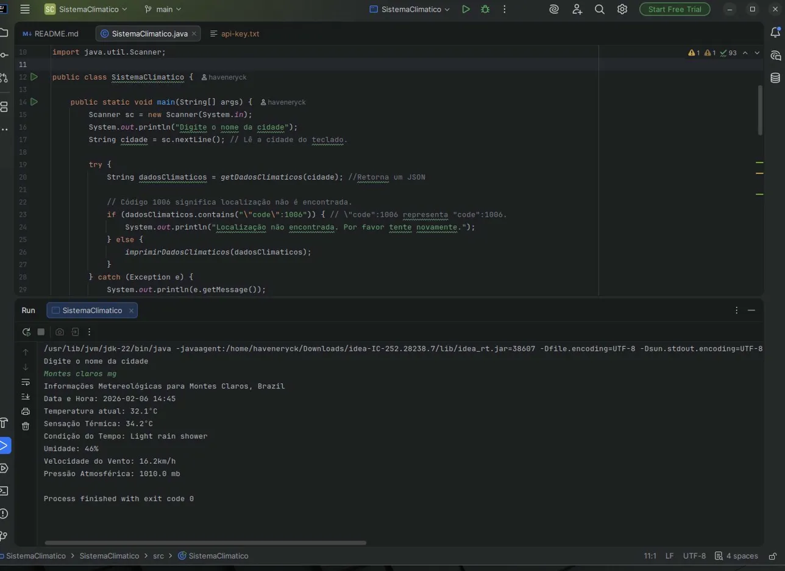
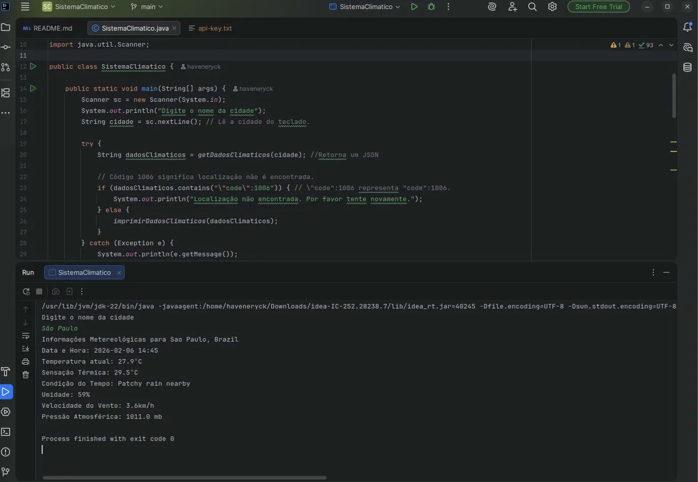

# 🌤️ Sistema de Informações Climáticas em Tempo Real

Sistema de consulta meteorológica via terminal desenvolvido em Java, consumindo a API WeatherAPI para obter dados climáticos atualizados de qualquer cidade do mundo.

## 🖼️ Screenshots

### Interface Inicial


### Montes Claros


### São Paulo


## 🎯 Funcionalidades

- ✅ Consulta de dados meteorológicos em tempo real
- ✅ Informações detalhadas: temperatura, sensação térmica, umidade, vento e pressão atmosférica
- ✅ Validação de localização (detecta cidades não encontradas)
- ✅ Formatação de entrada (aceita nomes de cidades com caracteres especiais)
- ✅ Tratamento robusto de exceções
- ✅ Parsing de dados JSON da API

## 🛠️ Tecnologias

- **Java** - Linguagem principal
- **HTTP Client** - Requisições HTTP nativas do Java 11+
- **JSON (org.json)** - Parsing de dados da API
- **WeatherAPI** - API meteorológica externa
- **URLEncoder** - Codificação de URLs

## 📋 Pré-requisitos

- Java 17 ou superior (testado com Java 22)
- Biblioteca JSON (`org.json`)
- Chave de API da [WeatherAPI](https://www.weatherapi.com/)

## ⚙️ Configuração

1. **Obtenha uma API Key gratuita:**
   - Acesse https://www.weatherapi.com/
   - Crie uma conta
   - Copie sua chave de API

2. **Configure a API Key:**
   - Crie um arquivo `api-key.txt` na raiz do projeto
   - Cole sua chave de API no arquivo
   - **Importante:** Não compartilhe sua chave publicamente!

## ▶️ Como executar
```bash
# Compilar
javac -cp ".:json-20240303.jar" SistemaClimatico.java

# Executar
java -cp ".:json-20240303.jar" SistemaClimatico
```

## 📸 Exemplo de uso
```
Digite o nome da cidade
Montes Claros

Informações Metereológicas para Montes Claros, Brazil
Data e Hora: 2025-01-09 18:30
Temperatura atual: 28.5ºC
Sensação Térmica: 30.2ºC
Condição do Tempo: Parcialmente nublado
Umidade: 65%
Velocidade do Vento: 12.5km/h
Pressão Atmosférica: 1013.2 mb
```

## 🏗️ Estrutura do código

- **`getDadosClimaticos(String cidade)`** - Realiza requisição HTTP e retorna JSON
- **`imprimirDadosClimaticos(String dados)`** - Faz parsing do JSON e exibe informações formatadas
- **`main(String[] args)`** - Ponto de entrada com validação e tratamento de erros

## 📚 Aprendizados

- Consumo de APIs REST externas
- Manipulação de requisições HTTP com HttpClient
- Parsing e extração de dados JSON
- Tratamento de exceções em operações de I/O
- Codificação de URLs para caracteres especiais
- Validação de entrada do usuário
- Organização de código em métodos reutilizáveis

## 🔐 Segurança

- API Key armazenada em arquivo separado (não versionado)
- Validação de respostas da API (código 1006 = localização não encontrada)
- Tratamento de exceções para requisições com falha

## 🚀 Possíveis melhorias futuras

- [ ] Interface gráfica com JavaFX
- [ ] Cache de consultas recentes
- [ ] Previsão do tempo para próximos dias
- [ ] Suporte a múltiplas cidades simultaneamente
- [ ] Histórico de consultas
- [ ] Gráficos de temperatura

## 📄 Licença

Projeto desenvolvido como parte do curso de Java para fins educacionais.

## 👤 Autor

**Vinicius Oliveira Brito**
- GitHub: [@haveneryck](https://github.com/haveneryck)
- LinkedIn: [linkedin.com/in/haveneryck](https://linkedin.com/in/haveneryck)
